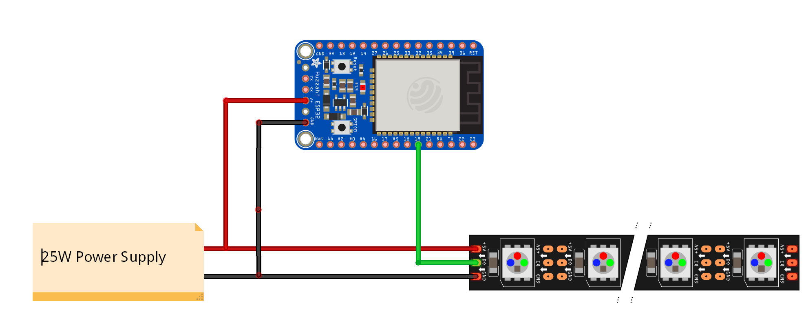

### Introduction
I came across the [PixelBlaze V2+](https://www.tindie.com/products/electromage/electromage-pixelblaze-v2-wifi-led-controller/) project a while back and thought it was really cool. The cost + shipping was too expensive for me so I decided to make something similar on my own. While the PixelBlaze is a really sophisticated project with its own pattern definition engine, custom math libraries, expansion boards and what not, I was looking for something simpler with support for custom/preset patterns and an app to control it over bluetooth

### Picking Parts
- A 1M strip with 60 WS2813 RGB LEDs from [Seedstudio](https://www.seeedstudio.com/Grove-WS2813-RGB-LED-Strip-Waterproof-60-LED-m-1m-p-3126.html). The WS281X series of LEDs are cheap and widely available, Adafruit uses them for a lot of their [Neopixel](https://www.adafruit.com/category/168) products. The WS2813 is the latest in the series with an LED bypass property which means that if an LED in the middle of the chain burns, the circuit remains closed and the other LEDs will still light up. As long as no other adjacent LEDs are broken, the remaining LEDs will continue to work normally. Interfacing with these LEDs is very simple as there's only one control signal.

- ESP32 DevKit
These NodeMCU chips cost about INR 400-500 on Amazon and are even cheaper at local stores. Get a few of these as they're cheap, feature packed and powerful enough to be used in a lot of projects

- 25W power supply. Each LED has a peak power consumption of 0.06A, the strip has 60 of them which requires a source that can supply 18W at 5V.
I got a cheap SMPS that does 5A at 5V but it's noisy (transformer hums). I guess a poweful phone charger should do too.

- 5V to 3v3 level shifter

- Misc. components like jumpers, soldering equipment, prototyping boards etc

### Architecture
Traditional projects with the ESP32 usually involve a web server with the chip running in access point mode but, this means that you'd have to disconnect from the home WiFi network and connect to the ESP's acces point every time you need to communicate with it. Since the ESP supports Bluetooth Low Energy, we can have a server running on it and use an Android app to scan for it and connect to it. Unfortunately though, BLE has a packet length limit of 20 bytes which can be extended to 512 bytes so sending large packets of data could be problematic. Some libraries take care of this by chunking messages before sending them


### Connections
5V out -> V<sub>in</sub>. The V<sub>in</sub> pin accepts unregulated supplies in the 5-12v range</br>
GND -> GND </br>
ESP32 Pin 19 -> Signal (Yeah well, that's pretty much it) </br>
The WS281X LED strip requires only one signal line which is convenient but, it doesn't support high refresh rates like the strips with SPI do. It requires a 5V signal line and the ESP32 only does 3.3v so we'll need a level shifter . Although the circuit will work without one, sometimes the colors might get messed up because of the voltage differences on the signal pin.



### Libraries
- FastLED - The awesome [FastLED](https://github.com/FastLED/FastLED) library is going to take care of all the heavy lifting like color code manipulation and communication with the LED strip. It offers helpful macros like `EVERY_N_MILISECONDS` for timed code as well
- ArduinoJSON - A mature and memory efficient JSON serialization/deserialization library for microcontrollers. This will be used to parse the payload from the app

### Testing out code on the ESP
For starters, we're going to add a limited set of effects like jumping/blending through a set of colors and a breathing effect. The code for each of them is fairly simple


```java
//Jumps through a set of colors with a specified duration
void jumpColors(CRGB leds[], uint8_t num_leds, CHSV colors[], uint8_t num_colors, uint8_t duration) {
    if (num_colors == 0) return;

    static uint8_t i = 0;
    static CRGB current_color = colors[i];

    EVERY_N_MILLISECONDS(duration) {
        fill_solid(leds, num_leds, current_color);
        current_color = colors[((++i) % num_colors)];
    }
}
```


```java
//Smoothly blends through a set of colors at a specific speed
void blendColors(CRGB leds[], uint8_t num_leds, CHSV colors[], uint8_t num_colors, uint8_t blendRate) {
    if (num_colors == 0) return;

    if (num_colors == 1) {
      fill_solid(leds, num_leds, colors[0]);
      return;
    }

    static uint8_t i = 0;
    static uint8_t amount_to_blend = 0;

    static CRGB current_color = colors[0];
    static CRGB target_color = colors[0];
    static CRGB start_color = colors[0];

    EVERY_N_MILLISECONDS(blend_rate) {

        if (target_color == current_color) {
            start_color = colors[i];
            i = (i + 1) % num_colors;
            target_color = colors[i];
            amount_to_blend = 0;
        }

        current_color = blend(start_color, target_color, amount_to_blend);
        fill_solid(leds, num_leds, current_color);
        amount_to_blend++;
    }
}
```

Neither of these effects take advantage of the fact that the LEDs are individually addressable so we're going to add another pattern that uses a color palette and paints the strip in a wave. To do that, we'll have to create a color palette from our list of colors and use `fill_palette` to color the LEDs. The end result looks something like this


FastLED supports color palettes which are essentially sets of colors. There are a lot of palettes available out of the box but we're going to create our own. We can specify a few colors as anchor points and FastLED will create a palette out of them where the colors smoothly transition across these points.

For example, specifying Black, Red, Yellow and White as the anchor points generates the following palette.

```c
DEFINE_GRADIENT_PALETTE( heatmap_gp ) {
    /*
    The first integer is the index of the anchor point from 0-255
    */
    0,   0,    0,  0,   //black
    128, 255,  0,  0,   //red
    224, 255,255,  0,   //bright yellow
    255, 255,255,255    //full white
};
```


To create a custom gradient palette at runtime we'll have to copy over our colors into an array of `TDynamicRGBGradientPalette_byte` and use the `loadDynamicGradientPalette` function to create it. Then we can just use `fill_palette` to pick colors from the palette and create the wavelike pattern

```java
CRGBPalette16 palette;

CRGBPalette16 & createPalette(CRGB colors[]) {

    /*
    We'll need at least two colors to create a palette.
    If the list has less than 2 colors, it'll default
    to a gradient palette transitioning from Red -> Blue
    */

    uint8_t num_palette_colors = 2;
    CRGB palette_colors[] = {CRGB::Red, CRGB::Blue};

    if (num_colors >= 2) {
      num_palette_colors = num_colors;
      memset(palette_colors, colors[0], num_colors);
      for (uint8_t i=0; i < num_palette_colors; i++) {
        palette_colors[i] = colors[i];
      }
    }

    TDynamicRGBGradientPalette_byte palette_anchors[num_palette_colors * 4];

    uint8_t index_step = 256 / (num_palette_colors - 1);

    for(uint8_t i=0; i < num_palette_colors; i++) {
        uint8_t palette_anchor_base = i*4;
        uint8_t color_index = (i == 0) ? 0 : (index_step * i) - 1;

        palette_anchors[palette_anchor_base] = color_index;
        palette_anchors[palette_anchor_base + 1] = palette_colors[i].red;
        palette_anchors[palette_anchor_base + 2] = palette_colors[i].green;
        palette_anchors[palette_anchor_base + 3] = palette_colors[i].blue;
    }
    return palette.loadDynamicGradientPalette(palette_anchors);
}

void cyclePalette(CRGB leds[], uint8_t num_leds, CRGBPalette16 palette, uint8_t cycle_rate) {
    static uint8_t start_index = 0;
    static uint8_t index_increment = 1;

    EVERY_N_MILLISECONDS(cycle_rate) {
        fill_palette(leds, num_leds, start_index, index_increment, palette, 100, LINEARBLEND);
        start_index = (start_index == 255) ? 0 : start_index + 1;
    }
}
```

### Possible features to add
-   Alexa/Google assistant integration
-   Dynamic patterns based on music being played
-   Changing colors based on the dominant color on the screen
-   Not sure how to go about this, this'll require plugging into the TV to know the dominant color or having a sensor facing the screen at all times