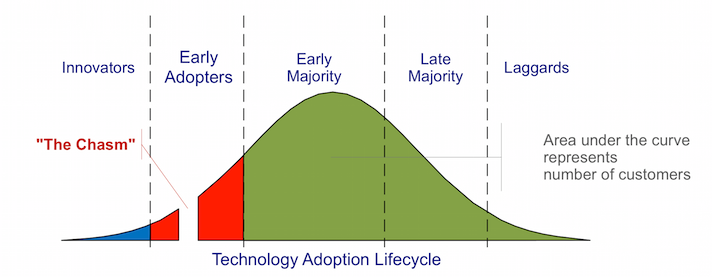
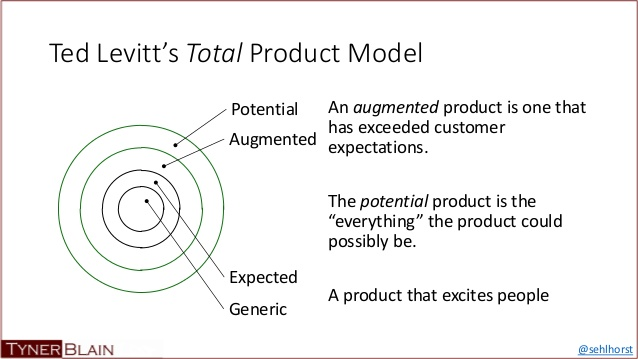

-	The technology market follows the technology adoption life cycle, which looks like a bell curve
	
	- The Innovators: Technology enthusiasts that want to be on the bleeding edge of research. They don't care whether it works really well. They just want to be the first ones to have their hands on it and for cheap. Their feedback is important because it's related to the core tech of the product. Marketing to them is more about exciting features, technology and exclusivity(in technological terms). 
	  - These are the kind of people that'll go out of their way to recommend a product if it's actually good. That's the best form of marketing
	  - Good feedback about improvements to be made to the product
	-	The Early Adopters a.k.a "Visionaries": They are enthusiastic about your product too, but in a more business centric way. Does your product bring a monumental change for the better in the way they do things? Is the improvement an order of magnitude higher than anything else? They're not afraid to take risks by moving important business processes to new technology. Marketing to this segment is more about quality, scalability and reliability.
		-	Visionaries bring with them a good network of clients and can be instrumental in making your product. 
		-	Try seeing 'the big picture' while marketing to them.

	-	The Early Majority a.k.a 'Pragmatists' : These guys make the bulk of the crowd. They want to use it only after a new product has proven its track record. It's a cycle, you have to prove your track record to appeal to them, but you can't have a track record without them. They will take advice only from similar minded people (Vertical networks). They're number crunchers and at the end of the day, if it isn't adding to the numbers, it's not worth looking into. They're constrained by budgets. Once convinced though, they're very loyal and might even help with improving the product. They strive to establish standards and keep the clockwork going. Marketing to them is just falling in line with their values.
		-	They need a good relationship with the company and need a well established ecosystem around the product. 
		-	They want it to work out of the box, like toasters and expect quality service.
		-	Easier to get into their network by being a value-added-reseller 
		-	They drive the cost down by increasing sales. 
		Examples: 
			-	Salesforce for computing as service
			-	Cisco for networking 
			-	MobileIron and Airwatch for BYOD work solutions
			-	Dan Warmenhove, Jeff Weiner, Meg Whitman, John Chen, Jogn Donahoe, Michael Dell
		
	-	The Late Majority a.k.a "Conservatives": Very traditional. They like out of the box solutions. Mostly single function products. They fear advanced technology and often invest only at the end of the cycle, when the cost is low and adoption is high and the product is essentially a must-have or a commodity. They want cheap pre-assembled packages. Convenience over Performance 
	Keep in mind:
		-	Focus on the 'whole product'. Bundle all possible solutions together because there's no money to be made in recurring support. 
		-	Think about a distribution channel that gets the product to them as smoothly as possible. 'As a service' ideas work great.
		-	Good opportunity to take low-cost, trailing-edge technology and repackage them into single function systems solving a specific business need. 
		-	Make sure the hidden costs like installation and training are low. 

	-	The Laggards a.k.a "Skeptics": These people are essentially haters, who have lost faith in the promises made by tech companies. They're essential in pointing out the discrepancies in marketing and the product. They constitute about 1/6th of the entire market. They fall in line eventually.

-	The Chasm
	-	The Innovators and Visionaries form the Early Market whereas the Pragmatists, Conservatives and Skeptics form the Mainstream Market. The chasm is the gap between these two. The transition is not smooth and the needs/ideologies of these two segments are very different. The Early Market is essential to get your product launched, the Mainstream Market is needed to streamline your process and establish market leadership.

	-	Visionaries have no respect for authority, age, experience etc. They like to define the state of the art. Pragmatists on the other hand think the leading edge is the bleeding edge. They're well respected by their peers and seldom take the advice of visionaries. So if a product is established, it puts off visionaries, but is liked by pragmatists. That's the catch.

	-   Crossing the Chasm
		-   Focus on areas which are in a lot of pain, essentially desperate for some new technology or service to solve that problem
		-   Segment your market and focus all your efforts(marketing and otherwise) on that segment. Follow niche marketing strategies and be the market leader in that segment 
		-  Horizontal expansion will come later, once you've expanded vertically and there are other vendors supporting your product. 
		-   Favor informed intuition vs reasoned analysis 
		-   Case Studies
			-   Documentum: Solved the painful process of documentation(niche market within medicine) for the approval of new drugs. Created a centralized repository of documents and saved a lot of man hours.
			-   Salesforce: Solved the problem of deploying/hosting software products in a simple, secure and cost effective way. Focused on sales personnel
			first, who liked the service so much that it went up the chain
			-   VMWare: Solved the problem of effective virtualization. Focused on incremental problems. First for the technologists by enabling them to run an OS in an OS, then for companies by virtualizing servers to save space/cost and optimize for multiple workloads, then for high performance workloads by virtualizing multiple servers as a single machine.

	-   Informed Intuition vs Reasoned Analysis(Low Data, High Risk Decisions)
		-   Turning to and finding confirmation in numbers is a bad thing to do in very early stages. Early stage thinkers won't know how to interpret those and numbers may lie.
		-   Favor informed intuition. Look for segments of buyers and try to define their characteristics. Isolate a few high quality archetypes of each segment and notice their characteristics.
		-   Try target customer characterization, imagine different customer characterizations and think of a unique way they would use the product. Reduce the number of characterizations once there are many, and prioritize by the most desirable target. 

	-   Target Customer Characterization
	  -   Informed intuition involves a lot of biases, prejudices and imperfect judgements. The results of that can be filtered by the processes below
	  -   Play out different scenarios of how a customer would be really inconvenienced without your product and how their life is made easier
	  by the use of it.
		  -   Scene or situation - Cause of frustration
		  -   Desired outcome - What's the user trying to do?
		  -   Attempted approach - How does the user do it without your product
		  -   Interfering factors - What goes wrong? Can your product fix it?
		  -   Economic consequences - What is the impact of the user failing to do the task?
		  -   New approach - Approach with your product in place
		  -   Enabling factors - What does your product fix
		  -   Economic reward - How much of an improvement is it over the old impact
		-   Market Development Strategy Checklist
		  -   Target customer - Single distinguishable economic buyer
		  -   Compelling reason to buy - Is there enough frustration for people to buy your stuff
		  -   Whole product - Is there/can there be an ecosystem around your product
		  -   Competition - Has this been solved before? How effectively?
		  -   Partners and allies - Other companies that can help with the whole product solution
		  -   Distribution - Does an appropriate sales channel exist? 
		  -   Pricing - Consistent with real world expectations?
		  -   Positioning - Is the company credible enough?
		  -   Next target customer - Can the customers be a gateway to the mainstream market?
		-   The segment should be small enough to be a monopoly and yet, large enough to matter to other segments. 

	-   The Whole Product Concept
		
		-	Generic product is what most startups make, the first iteration
		The expected product is what is marketed to the customer. Basically what they think they’ll get
		The augmented product is how much better your product can be with existing add-ons 
		The potential product is the full blown experience 
		-	Early markets work on the generic product, mainstream markets work on the whole product. Enthusiasts like to figure out how to integrate
		different products so the whole product doesn't matter to them. Visionaries want to create an ecosystem for the whole product. Pragmatists won't
		anything less than the whole product
		-	Using target customer scenarios, think about what more can be done to move towards the whole product and try to provide those things.
		Just throwing the product out there might kill it because there is nothing to sustain it
		-	Case Studies
			-	Aruba
			-	Lithium

	-	Positioning
		-	Competition can be a good thing at this stage since, it adds credibility to the your product and pragmatist buyers like choices. Enthusiasts/Visionaries are the "product" centric, Pragmatists/Skeptics are "market" centric. They need good support, plugins, long-term contracts, compatibility etc.
		-	The two kinds of competitors that can help at this stage are
			-	Market competitor - The incumbent that you're trying to replace. They have a well established ecosystem in place but you want the pragmatists to believe that they're using old and outdated technology. These competitors also give you an idea of how you should price your product/service.
			-	Product competitor - Your direct competitors who are using similar technology. They provide credibility to your product that what you're doing does indeed make sense, otherwise it wouldn't have competition. 
		-	Treat it as a noun first, then a verb. It can have the largest impact on the buying decision. A positioning that requires the least amount of change in a customer's thinking is the most effective
			-	As a noun, find your niche, imagine a target customer and make a compelling reason to buy. Think easier to buy and not easier to sell
			-	Develop or find competition around your area to convince pragmatists and conservatives 
			-	As a verb, create a concise description of your product(naming and framing). Describe who it's for and how they'll use it. Lastly 
			add some differentiation from competition
			-	Claim -> Evidence -> Communication -> Feedback

	-	Distribution and Pricing
		-	Follow customer oriented distribution and set distribution oriented pricing
		-	There'll be mainly five types of buyers
			-	Big enterprise -> 2-5 sales are enough - needs custom installation
			-	Top Executive at firms -> 6-10 sales are enough - 
			-	Team leader at a software firm -> need around 50-100 sales
			-	Small Business -> 100+ sales
			-	Consumer -> 10k sales minimum, SaaS offerings only
